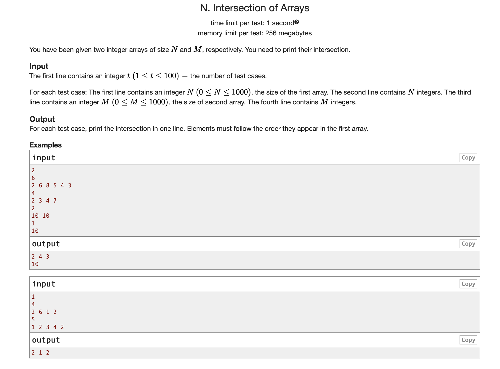
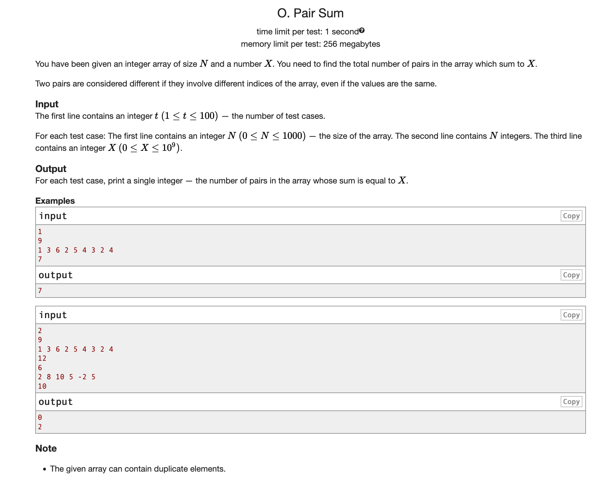

## Arrays
### Challenging problems:
1. 
   - problem faced: not handling the case when n =0 or m = 0. The input criteria needs to handled correctly. if n == 0 the array will be empty but it will start reading the next input of m as of array.
   - The solution needs to be optimized, using remove method is inefficient here since it will search the entire array again.
   - Needs to use a dictionary
  
2. 
   - Problem faced in understanding of the question.
   - Use of dictionary.
   - Got confused multiple times.