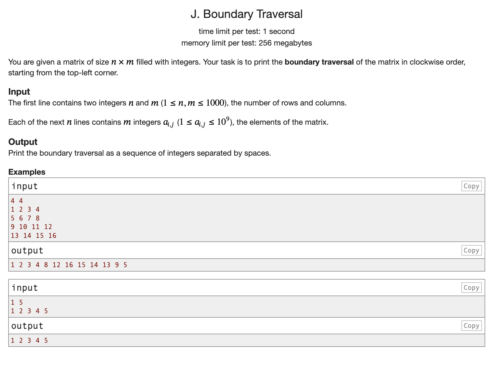

Complete Problem set: [Drive Link](https://drive.google.com/file/d/1yVm-blr8m3bgDOnxt-NRdg8CLhkOqwBY/view?usp=drive_link)

### The Following is the Discussion of the Problems that I struggled with:

  

[J-Boundary-Traversal](./J_Boundary_Traversal.py)
- Didn't face much difficulty.
- I implemented 4 function calls for 4 directions which is write but GPT solution is more pythonic and shorter. Uses slicing methods.
  - We don't necessarily need to do function calls, simple for loops will also work