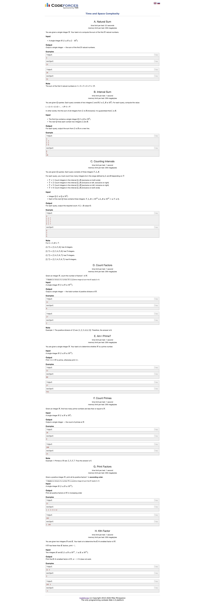

# Problems

---

# Discussions of the problems

## H: return K-th factor if exists
### 1. Brute Force
- Run a loop from 1 to n+1
- Store all the factors
  - will be stored in sorted order by default
- return factors[k-1] or -1
- TC, SC: O(n), O(m)

### 2. Better
- Given a `num` and `k`, we have to return the kth factor of the num else -1
- There is a time limit constraint we can't run O(N). n = len(num)
- So the logic being, 
  - Store the factors using $\sqrt(n)$
  - sort the factors. **Will be $O(m * ln{m})$ m = len(factors), so $m <<< n$.**
  - return factors[k-1] or -1
- TC: $O(\sqrt(n) + m\cdot{\ln{m}}) < O(n)$
- SC: $O(m)$ 
---

Extra topic to know - Number Theory:

Yes, there is a formal way to calculate the exact number of factors, and a handy approximation for how many factors a number *usually* has.

#### 1. The Exact Formula (Prime Factorization)

To find the exact number of factors, you don't actually need to list them. You can use the **Divisor Function**, denoted as $d(n)$.

**The Steps:**

1. Find the **prime factorization** of the number.
* $n = p_1^{a} \cdot p_2^{b} \cdot p_3^{c} \dots$

2. The number of divisors is found by adding $1$ to each exponent and multiplying them together:
* $d(n) = (a + 1)(b + 1)(c + 1) \dots$

**Example for $n = 12$:**

* Prime factorization: $12 = 2^2 \cdot 3^1$
* Exponents are $2$ and $1$.
* Number of factors: $(2 + 1)(1 + 1) = 3 \cdot 2 = \mathbf{6}$
* *(Verification: 1, 2, 3, 4, 6, 12)*

---

#### 2. The Approximation (Average Case)

On average, the number of divisors for a number $n$ is approximately **$\ln(n)$** (the natural logarithm).

However, this is just an average. The "true" behavior is very erratic:

* **Primes:** Always have exactly $2$ factors, no matter how large $n$ is.
* **Highly Composite Numbers:** These are "record-breakers" that have more factors than any number smaller than them (like 12, 60, 720).

#### 3. The "Worst Case" for your Code

If you are worried about your `sort()` speed, you want to know the maximum possible $m$ for a given $n$.

A helpful upper bound for the number of divisors $d(n)$ is:

$$d(n) \approx n^{\frac{1.066}{\ln(\ln n)}}$$

In practical terms for competitive programming:

* $n \approx 10^6 \implies$ Max divisors $\approx 240$
* $n \approx 10^9 \implies$ Max divisors $\approx 1,344$
* $n \approx 10^{12} \implies$ Max divisors $\approx 6,720$
* $n \approx 10^{18} \implies$ Max divisors $\approx 103,680$

- Even at $10^{18}$, having $\sim 100,000$ factors is still "small" for a computer. Sorting $100,000$ integers takes roughly **$0.02$ seconds** in Python. This confirms that your $\sqrt{n}$ approach followed by a `sort()` is extremely safe!

### Optimal
- TC: O$(\sqrt{n})$
- SC: O(1)
- Run the first half the loop in forward, let for n == 12; store the factors d, as 1, 2, 3
- Then run a second O$(\sqrt{n})$ loop in backward order from, $d \in [\sqrt{n}, 1]$ and the factors will be $n//d$.
- Don't store the factors but keep a counter; when counter reach k return d if in the first loop or n//d if in the second loop

