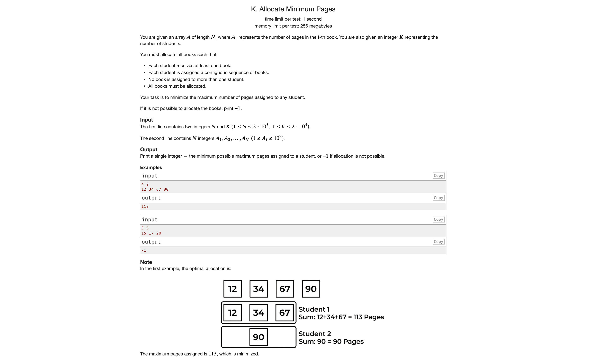

<div style="display: flex; justify-content: center; margin-top: 10px;">
  <span style="
    background-color: black;
    box-shadow: 0 0 40px #ec582b;
    font-family: monospace;
    font-size: 38px;
    color: white;
    padding: 10px 20px;
    border-radius: 5px;
  ">
    Problems
  </span>
</div>




---

<div style="display: flex; justify-content: center; margin-top: 10px;">
  <span style="
    background-color: #333333;
    box-shadow: 0 0 40px #2becbc;
    font-family: monospace;
    font-size: 38px;
    color: #F2F2F2;
    padding: 10px 20px;
    border-radius: 5px;
  ">
    Solutions
  </span>
</div>

---

- Class Notes: [Class Note](https://drive.google.com/file/d/1Eyt5mMXpIX02vtHI0vIOJHKh2ZO-Dc7O/view?usp=drive_link)


---

# Python `bisect` — Complete Notes (Binary Search Replacement)

---

## 1. What is `bisect`?

- `bisect` is a Python module that provides **binary search utilities**.
- It works on **sorted arrays only**.
- Instead of searching for existence, it finds **insertion positions**.

---

## 2. Core Functions

```python
from bisect import bisect_left, bisect_right

bisect_left(arr, x)
	•	Returns the first index where x can be inserted
	•	Equivalent to: lower_bound (C++)

bisect_right(arr, x) or bisect(arr, x)
	•	Returns the first index where element > x
	•	Equivalent to: upper_bound (C++)

⸻

3. Key Concept (Most Important)
	•	bisect_left → left boundary (inclusive)
	•	bisect_right → right boundary (exclusive)

So the valid range of x is:

[left, right)


⸻

4. Example

arr = [1, 2, 2, 2, 3, 4, 4, 4]

l = bisect_left(arr, 2)   # 1
r = bisect_right(arr, 2)  # 4

index:  0 1 2 3 4 5 6 7
value: [1 2 2 2 3 4 4 4]
         ↑     ↑
       left   right


⸻

5. Frequency of Element

count = bisect_right(arr, x) - bisect_left(arr, x)

Example

x = 2
count = 4 - 1 = 3


⸻

6. Check if Element Exists

i = bisect_left(arr, x)

if i < len(arr) and arr[i] == x:
    print("Exists")
else:
    print("Does not exist")


⸻

7. Find First Element ≥ x

i = bisect_left(arr, x)

	•	If i < n, then arr[i] is the answer

⸻

8. Find First Element > x

i = bisect_right(arr, x)


⸻

9. Count Elements in Range [L, R]

count = bisect_right(arr, R) - bisect_left(arr, L)


⸻

10. Insert While Maintaining Sorted Order

from bisect import insort

arr = [1, 2, 4, 5]
insort(arr, 3)

# arr becomes [1, 2, 3, 4, 5]

	•	Time complexity: O(n) (due to shifting)

⸻

11. Time Complexity
	•	Each bisect call → O(log n)
	•	Insertion (insort) → O(n)

⸻

12. When to Use bisect

Use when:
	•	Array is sorted
	•	Need:
	•	Frequency counting
	•	Range queries
	•	Lower/upper bounds
	•	Binary search replacement

⸻

13. When NOT to Use

Avoid when:
	•	Array is unsorted
	•	Frequent insertions/deletions → use other data structures
	•	Only need frequency → use hashmap (faster)

⸻

14. Common Mistakes
	•	Using bisect on unsorted array
	•	Forgetting:

count = right - left


	•	Assuming bisect_right gives last index (it gives last + 1)

⸻

15. Comparison with Manual Binary Search

Task	Manual BS	bisect
Find element	Yes	Indirect
Lower bound	Complex	Easy
Upper bound	Complex	Easy
Code length	Long	Short


⸻

16. Mental Model
	•	Think of bisect as:
“Where should I insert this value in sorted order?”
	•	Not:
“Where does this value exist?”

⸻

17. Minimal Template

from bisect import bisect_left, bisect_right

arr.sort()

# frequency
def count(x):
    return bisect_right(arr, x) - bisect_left(arr, x)


⸻

18. Practice Patterns
	•	Frequency queries
	•	Range count queries
	•	Closest element problems
	•	Coordinate compression
	•	Two pointers + binary search hybrid problems

⸻

Summary
	•	bisect_left → first occurrence
	•	bisect_right → one past last occurrence
	•	Always operate on sorted arrays
	•	Frequency = right - left
	•	Clean and safer than manual binary search for bounds