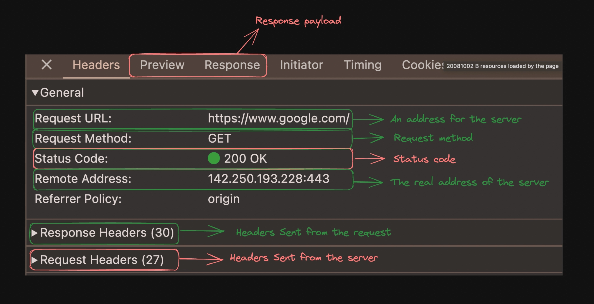
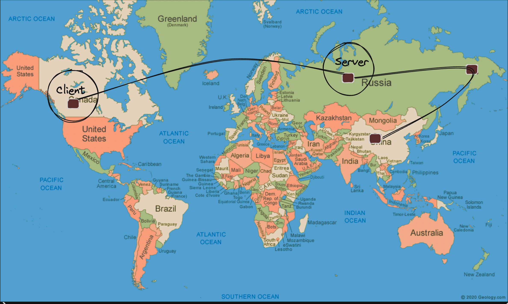
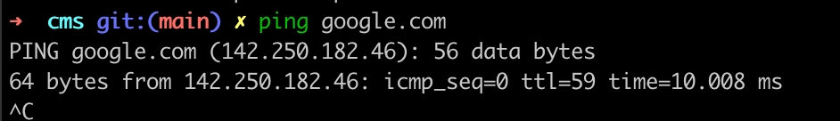
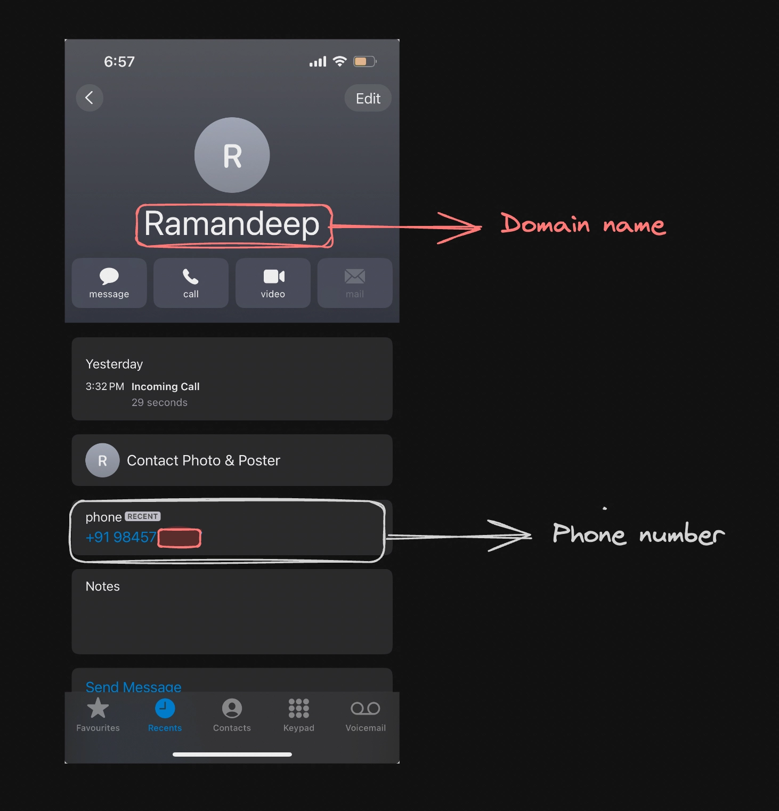

- [1. Why the HTTP Protocol?](#1-why-the-http-protocol)
- [2. Request response model](#2-request-response-model)
- [3. Domain and IPs](#3-domain-and-ips)
  - [3.1. **IPs**](#31-ips)
    - [3.1.1. Real world analogy](#311-real-world-analogy)
  - [3.2. DNS](#32-dns)
    - [3.2.1. Simple explanation](#321-simple-explanation)
    - [3.2.2. How DNS works (short flow)](#322-how-dns-works-short-flow)
    - [3.2.3. Useful DNS commands](#323-useful-dns-commands)
  - [3.3. Summary](#33-summary)
    - [3.3.1. Domains and IPs](#331-domains-and-ips)
    - [3.3.2. Common DNS record types](#332-common-dns-record-types)
- [4. Ports](#4-ports)
- [5. Methods](#5-methods)
  - [5.1. **Common methods**](#51-common-methods)
- [6. Response](#6-response)
    - [6.0.1. **JSON**](#601-json)
- [7. Status Codes](#7-status-codes)
    - [7.0.1. **200 series (Success)**](#701-200-series-success)
    - [7.0.2. **300 series (Redirection)**](#702-300-series-redirection)
    - [7.0.3. **400 series (Client Error)**](#703-400-series-client-error)
    - [7.0.4. **500 series (Server Error)**](#704-500-series-server-error)
    - [7.0.5. **Meme section**](#705-meme-section)
- [8. Body / Payload](#8-body--payload)
- [9. Routes](#9-routes)
- [10. Clients (Postman / curl / Browser)](#10-clients-postman--curl--browser)
    - [10.0.1. **curl**](#1001-curl)
    - [10.0.2. **Browser**](#1002-browser)
    - [10.0.3. **Postman**](#1003-postman)
- [11. Writing HTTP Code in Express](#11-writing-http-code-in-express)
- [12. Headers](#12-headers)


# 1. Why the HTTP Protocol?


Back in the day, HTTP was introduced so machines all around the world could talk to each other.
- This would be useful for things like
    1. Talking via im (instant messenger)
    2. Emails
    3. Accessing an algorithm that is only available on a very big machine at Stanford lets say
 
- Slowly the HTTP Protocol was formalised and now spec’d out here - https://datatracker.ietf.org/doc/html/rfc2616
 
<details><summary>Mini assignments</summary>
Try exploring the network tab and seeing all the HTTP requests that go out when you visit <a src= 'https//:google.com'>https://google.com</a>
</details>


http is the most used almost 99% of the internet protocol today. There are bunch of other protocols as well like websockets, webtgs used for specific scenarios like zoom uses.

In short a protocol, http provides us the response for our request from a server where the original code is stored without having the real program in our system via internet.

---

# 2. Request response model

The request-response model is a fundamental communication pattern.

It describes how data is exchanged between a `client` and a `server` or between two systems.

HTTP works on req-res model, but there are few apps like zoom, chat apps where this model fails, why? Because in chat kind of application in case of a large group there will be thousands of interactions happen so we need something else.



<details>

<Summary><b>Are there other ways for you to communicate b/w machines?</b></Summary>

Yes, there are various other protocols that exist that let machines communicate with each other.
    1. Websockets
    2. WebRTC
    3. GRPC
    4. JsonRPC
</details>

---

# 3. Domain and IPs

The way to reach a sever is through its `Domain name` . For example

1. google.com
2. app.100xdevs.com
3. x.com

## 3.1. **IPs**

Every domain that you see, actually has an underlying IP that it `resolves` to.

IPv4 addresses range from 0.0.0.0 to 255.255.255.255, and IPv6 uses a different, hexadecimal format to support many more addresses.

You can check the ip by running the `ping` command.

```bash
ping google.com
```



When you try to visit a website, you are actually visiting the `underlying IP address`. 142.251.43.14 , for example, google.com might resolve to 142.251.43.14 at a given time.

### 3.1.1. Real world analogy

Domain name - Phone contact

IP - There real phone number



Big applications like google amazon can have multiple IPs since to scale the application to billions of users the code can be deployed on multiple servers across the world.

---
## 3.2. DNS

DNS (Domain Name System) is the system that translates human-readable domain names like `google.com` into IP addresses like `142.251.43.14` so computers can find each other on the internet.cloudflare+2

### 3.2.1. Simple explanation

- Think of DNS as the **phonebook** or contacts app of the internet: you remember names, it looks up the numbers (IP addresses).
- Every time you type a URL in the browser, your device uses DNS in the background to get the correct IP and then connects to that server.


> **DNS (Domain Name System)**
> 
> 
> DNS is a hierarchical, distributed naming system that maps domain names (like `example.com`) to IP addresses (like `93.184.216.34`).geeksforgeeks+2
> 
> It lets users use readable names instead of remembering numeric IPs, similar to a phonebook that maps contact names to phone numbers.digicert+2
> 
> DNS is used every time a browser, app, or service needs to locate a server on the internet using a domain name.cornell+2
> 

### 3.2.2. How DNS works (short flow)

1. Browser checks its own cache for the domain’s IP.
2. If not found, it asks the OS resolver (system DNS cache).
3. OS resolver sends the query to a recursive DNS server (usually your ISP or a public DNS like 8.8.8.8).
4. Recursive DNS, if needed, queries:
    - Root DNS servers (to find the TLD server, like `.com`),
    - Then TLD DNS servers (to find the authoritative server for `example.com`),
    - Then the authoritative DNS server (which knows the real IP).
5. Recursive DNS returns the final IP to the OS, which gives it to the browser, and the browser connects to that IP.[[notion](https://www.notion.so/Domain-name-IP-31b3934632d2809da3d0cb00ba48ba21?pvs=21)]

---

### 3.2.3. Useful DNS commands

- `ping google.com` – Checks reachability and shows the resolved IP address.[[notion](https://www.notion.so/Domain-name-IP-31b3934632d2809da3d0cb00ba48ba21?pvs=21)]
- `nslookup google.com` – Shows DNS information for the domain (name server, IP, etc.).[[notion](https://www.notion.so/Domain-name-IP-31b3934632d2809da3d0cb00ba48ba21?pvs=21)]
- `dig google.com` – More detailed DNS query output, useful for debugging DNS.[[notion](https://www.notion.so/Domain-name-IP-31b3934632d2809da3d0cb00ba48ba21?pvs=21)]

---
## 3.3. Summary
### 3.3.1. Domains and IPs

- One domain can map to multiple IPs to support load balancing and CDNs (traffic is distributed across many servers).
- One IP can host many domains using virtual hosting (common in shared hosting servers).[[notion](https://www.notion.so/Domain-name-IP-31b3934632d2809da3d0cb00ba48ba21?pvs=21)]

---

### 3.3.2. Common DNS record types

- **A** – Maps a domain to an IPv4 address.
- **AAAA** – Maps a domain to an IPv6 address.
- **CNAME** – Alias from one domain name to another domain name.
- **MX** – Specifies mail servers responsible for receiving email for the domain.[[notion](https://www.notion.so/Domain-name-IP-31b3934632d2809da3d0cb00ba48ba21?pvs=21)]

---

# 4. Ports

In networking, **ports** are `logical` endpoints used by protocols to identify `specific processes`  running on a computer or server. They help direct network traffic to the correct application or service on a system.


The default port for a https is 443 and for http its 80.

**Remote address: IP:Port**

---

# 5. Methods

Every http request that we sent needs to have a method associated with it, about what do we wanna do? 

- HTTP methods are used to specify the type of action that the client wants to perform on a resource on the server.

<aside style = "background-color: beige; padding: 10px 10px 10px 20px; border-radius: 10px">
💡

You done NEED to use all the methods, but you always should. You can do everything you want with a `GET` or `POST`  method, but it is usually advisable to use them right.

</aside>

## 5.1. **Common methods**

1. GET - Retrieve data from a server. (Get my TODOS)
2. POST - Submit data to be processed by a server. (Create a TODO)
3. PUT - Update or create a resource on the server (Update my todo)
4. DELETE - Remove a resource from the server. (Delete my todo)


---

# 6. Response

The response represents what the server returns you `in response` to the request.

The payload which we get back could be

1. Plaintext data - Not used as often
2. HTML - If it is a website
3. JSON Data - If you want to fetch some data (user details, list of todos…)

### 6.0.1. **JSON**

**JSON** stands for **JavaScript Object Notation**. It is a lightweight, text-based format used for data interchange

```jsx
{
  "name": "John Doe",
  "age": 30,
  "isEmployed": true,
  "address": {
    "street": "123 Main St",
    "city": "Anytown"
  },
  "phoneNumbers": ["123-456-7890", "987-654-3210"]
}
```


---


# 7. Status Codes

HTTP status codes are three-digit numbers returned by a server to indicate the outcome of a client’s request. They provide information about the status of the request and the server's response.

### 7.0.1. **200 series (Success)**

- **200 OK**: The request was successful, and the server returned the requested resource.
- **204 No Content**: The request was successful, but there is no content to send in the response

### 7.0.2. **300 series (Redirection)**

- **301 Moved Permanently**: The requested resource has been moved to a new URL permanently. The client should use the new URL provided in the response.
- **304 Not Modified**: The resource has not been modified since the last request. The client can use the cached version.

### 7.0.3. **400 series (Client Error)**

- **400 Bad Request**: The server could not understand the request due to invalid syntax.
- **401 Unauthorized**: The request requires user authentication. The client must provide credentials.
- **403 Forbidden**: The server understood the request but refuses to authorize it.
- **404 Not Found**: The requested resource could not be found on the server.

### 7.0.4. **500 series (Server Error)**

- **500 Internal Server Error**: The server encountered an unexpected condition that prevented it from fulfilling the request.
- **502 Bad Gateway**: The server received an invalid response from an upstream server while acting as a gateway or proxy.


### 7.0.5. **Meme section**


---

# 8. Body / Payload

In HTTP communications, the **body** (or **payload**) refers to the part of an HTTP message that contains the actual data being sent to the server.

It is usually `JSON` data that is transferred to the server.

For example -

```jsx
{
    todo: "Go to the gym"
}
```


---

# 9. Routes

In the context of HTTP, **routes** are paths or endpoints that define how incoming requests are handled by a server. Routing is a mechanism used to direct incoming HTTP requests to the appropriate handler functions or resources based on the URL path.


---

# 10. Clients (Postman / curl / Browser)

Postman lets you send HTTP requests to a server, just like your browser. It gives you a prettier interface to send requests and play with them.

You can send a request from various `clients` , Postman being one of them.

Installing postman - https://www.postman.com/downloads/

### 10.0.1. **curl**


### 10.0.2. **Browser**


### 10.0.3. **Postman**


---

# 11. Writing HTTP Code in Express
[https://www.npmjs.com/package/express](https://www.npmjs.com/package/express)
[Go here](README.md#2-http-deep-dive)

---

# 12. Headers

HTTP headers are ***key-value pairs*** included in HTTP requests and responses that provide **metadata** about the message. 
 
<h3>Why not use body?</h3>

Even though you can use body for everything, it is a good idea to use **headers** for sending data that isn’t directly related with the **application logic**.

- For example, if you want to create a new TODO, you will send the TODO payload in the body
```js
{
   description: "Go to gym"
}
```
But the **Authorization** information in the `headers`

`Authorization: harkirat`


- By now we are expected to understand the response payload.

 