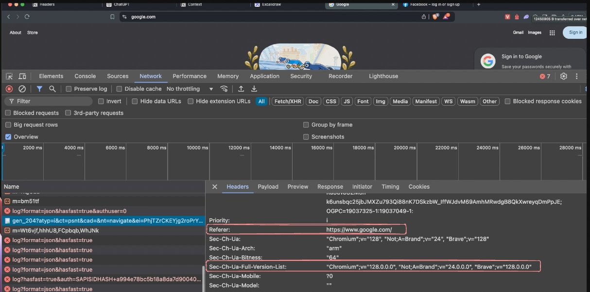
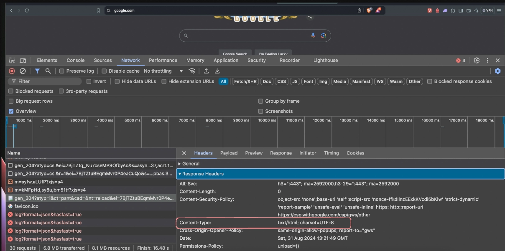
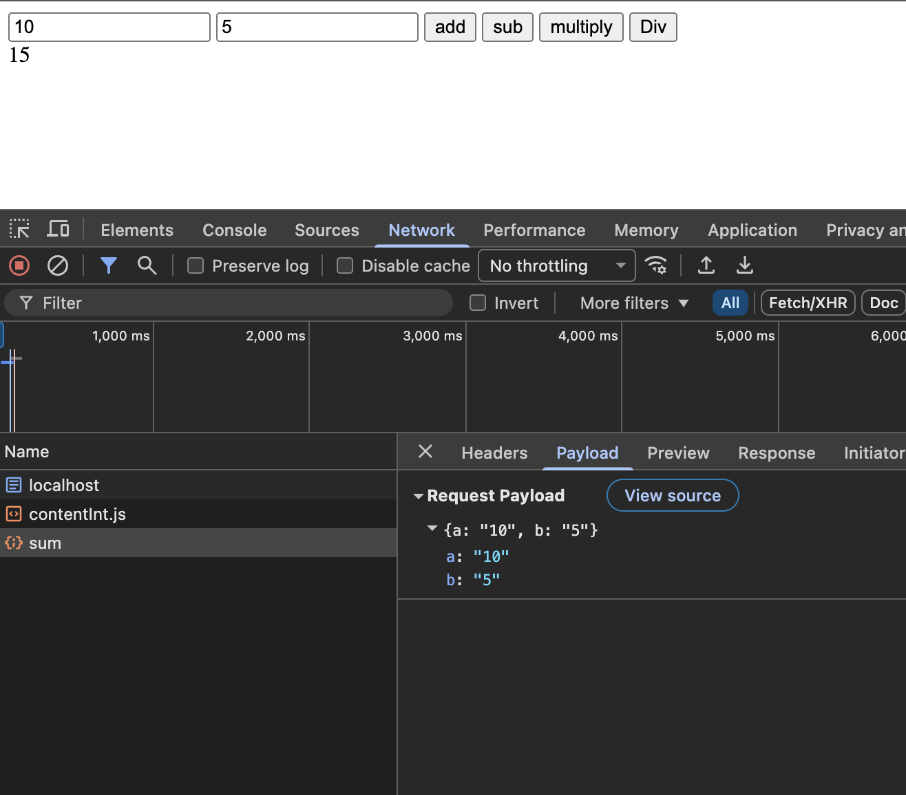
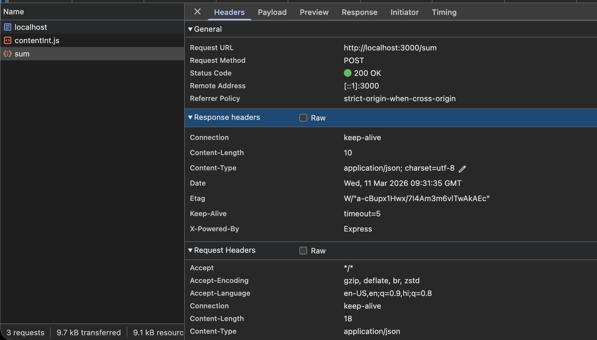
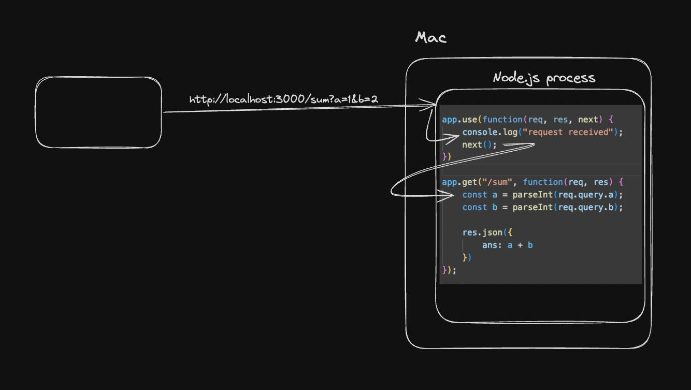
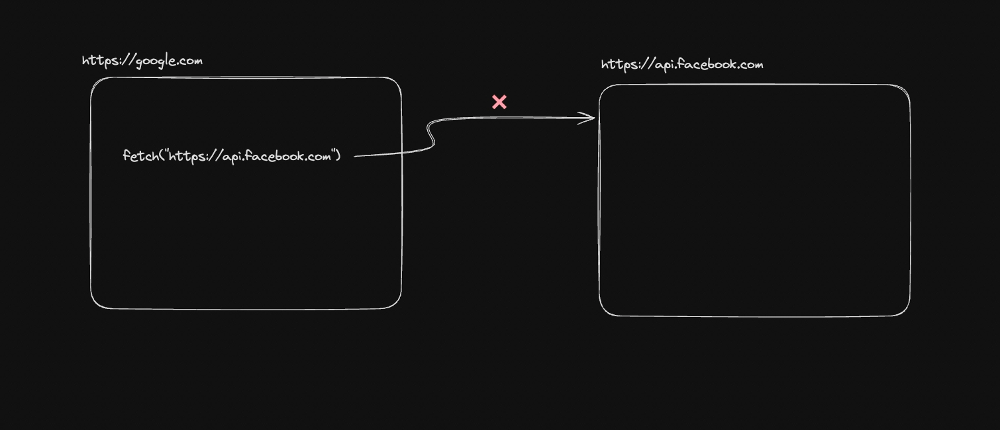
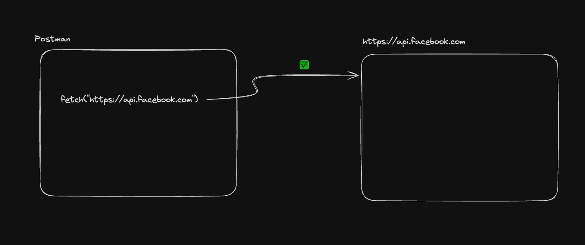
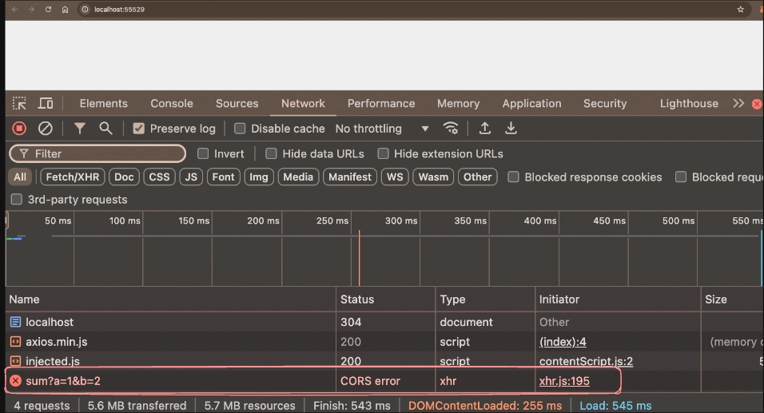
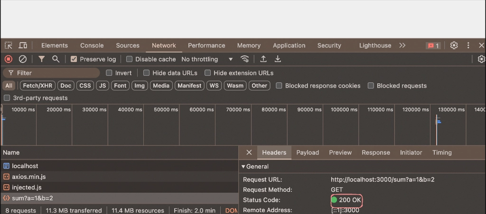
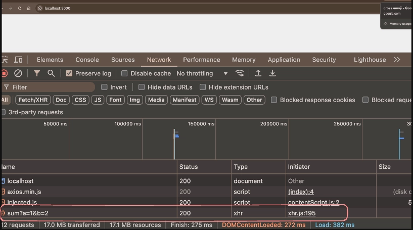

- [1. HTTP Server - Intro Recap (Theory)](#1-http-server---intro-recap-theory)
- [2. HTTP Deep Dive](#2-http-deep-dive)
  - [2.1. Headers](#21-headers)
      - [2.1.0.1. Request headers](#2101-request-headers)
      - [2.1.0.2. Response headers](#2102-response-headers)
  - [2.2. Create an HTTP Server - Express](#22-create-an-http-server---express)
      - [2.2.0.1. The misconception](#2201-the-misconception)
  - [2.3. Fetch API](#23-fetch-api)
    - [2.3.1. Fetch request examples](#231-fetch-request-examples)
      - [2.3.1.1. Fetch req sending using post method and the body or payload](#2311-fetch-req-sending-using-post-method-and-the-body-or-payload)
    - [2.3.2. Recap and concept clearance for the topics done till now (Using GPT)](#232-recap-and-concept-clearance-for-the-topics-done-till-now-using-gpt)
      - [2.3.2.1. 1️⃣ Sending Data via Path Parameters (GET)](#2321-1️⃣-sending-data-via-path-parameters-get)
      - [2.3.2.2. 2️⃣ Sending Data via Query Parameters (GET)](#2322-2️⃣-sending-data-via-query-parameters-get)
      - [2.3.2.3. 3️⃣ Sending Data via Body / Payload (POST)](#2323-3️⃣-sending-data-via-body--payload-post)
      - [2.3.2.4. the differences in the browser what actually happens when using body (payload) and query params](#2324-the-differences-in-the-browser-what-actually-happens-when-using-body-payload-and-query-params)
    - [2.3.3. 4️⃣ Why POST is Used for Payload](#233-4️⃣-why-post-is-used-for-payload)
    - [2.3.4. 5️⃣ Example Without Axios (HTML Form)](#234-5️⃣-example-without-axios-html-form)
    - [2.3.5. Using axios (external library)](#235-using-axios-external-library)
      - [2.3.5.1. Are all these frontend code talking to the backend?](#2351-are-all-these-frontend-code-talking-to-the-backend)
      - [2.3.5.2. Will the URL be the backend URL?](#2352-will-the-url-be-the-backend-url)
      - [2.3.5.3. Is this URL called an API?](#2353-is-this-url-called-an-api)
        - [2.3.5.3.1. Correct terminology](#23531-correct-terminology)
      - [2.3.5.4. Important mistake in your POST code](#2354-important-mistake-in-your-post-code)
      - [2.3.5.5. Why Axios feels simpler](#2355-why-axios-feels-simpler)
      - [2.3.5.6. One conceptual model to remember](#2356-one-conceptual-model-to-remember)
      - [2.3.5.7. One more deeper concept (very important)](#2357-one-more-deeper-concept-very-important)
  - [2.4. Middlewares](#24-middlewares)
    - [2.4.1. Route specific middlewares](#241-route-specific-middlewares)
      - [2.4.1.1. Simple Assignment questions on Middlewares](#2411-simple-assignment-questions-on-middlewares)
    - [2.4.2. Commonly used middlewares](#242-commonly-used-middlewares)
  - [2.5. cors - Cross origin resource sharing](#25-cors---cross-origin-resource-sharing)


# 1. HTTP Server - Intro Recap (Theory)
[Read the HTTP Server Intro Notes](Intro-to-HTTP.md)
- what's http protocol
- request
- response body
- req res model
- body/payload
- methods
  - GET
  - POST
  - PATCH
  - PUT
  - DELETE
- Domain name/IP
- status codes
- HTTP Clients
  - curl
  - browsers
  - postman/requestly

---

# 2. HTTP Deep Dive

## 2.1. Headers

HTTP headers are key-value pairs sent between a client (like a web browser) and a `server` in an **HTTP request or response**. They convey *metadata* about the request or response, such as content type, auth information etc.

- **Common headers**
  1. Authorization (Sends the user auth information)
  2. Content-Type - Type of information client is sending (json, binary etc)
  3. Referer - Which URL is this request coming from
 
 
#### 2.1.0.1. Request headers
-  The headers the *client* sends out in the request are known as `request` headers


#### 2.1.0.2. Response headers
- The headers that the *server* responds with are known as the `response` headers.



---

## 2.2. Create an HTTP Server - Express
- Practice Code: [Calculator with Backend](/backend/calculator-http-server/)
- Technically we could do this using DOM only using onclick and all.


---

#### 2.2.0.1. The misconception
- While building the calculator backend.
- It is very much possible to create the calculator app using the DOM manipulation.
- But that would make the app only a **client side** application, what that mean is, anyone can read the logic of the app how it’s get built, since the frontend will be rendered to the browser.
- So when we are building the backend we are keeping the core logic of the app hidden.
- But we need our frontend to talk to our backend, the frontend as a client and the backend as a server.
- That is where Fetch api comes in

---

## 2.3. Fetch API
- This is how frontend talks to backend using the endpoints


- There are 2 high level ways a browser can send requests to an HTTP server:
**1. From the browser URL (Default GET request):**
- When you type a URL into the browser’s address bar and press Enter, the browser sends an HTTP GET request to the server. This request is used to retrieve resources like HTML pages, images, or other content.

**2. From an HTML form or JavaScript (Various request types):**
- HTML Forms: When a user submits a form on a webpage, the browser sends an HTTP request based on the form’s method attribute, which can be GET or POST. Forms with method="POST" typically send data to the server for processing (e.g., form submissions).

- **JavaScript (Fetch API):** JavaScript running in the browser can make HTTP requests to a server using APIs the fetch API. These requests can be of various types (GET, POST, PUT, DELETE, etc.) and are commonly used for asynchronous data retrieval and manipulation (e.g., AJAX requests).

### 2.3.1. Fetch request examples
Server to send the request to - https://jsonplaceholder.typicode.com/posts/1 (GET request)

```html
<!DOCTYPE html>
<html>

<body>
  <div id="posts"></div>
  <script>
    async function fetchPosts() {
      const res = await fetch("https://jsonplaceholder.typicode.com/posts/1");
      const json = await res.json();
      document.getElementById("posts").innerHTML = json.title;
    }

    fetchPosts();
  </script>
</body>

</html>

```

- till now we have built this, a functional backend of a calculator app


--- 


#### 2.3.1.1. Fetch req sending using post method and the body or payload
- we have already sent the requests using params query. now let's try to send the req using payload
- when using body, we have to send or post something from the client to the backend directly so we have to use app.post to read the data from the post method.


### 2.3.2. Recap and concept clearance for the topics done till now (Using GPT)
Yes — your intuition is correct. When you **send data in the request body (payload)**, you typically use the **POST method**. Let’s clarify how the different approaches work in backend development with **Express**.

---

#### 2.3.2.1. 1️⃣ Sending Data via Path Parameters (GET)

Data is part of the **URL path**.

Example request:

```
GET /add/5/7
```

Express route:

```javascript
app.get("/add/:a/:b", (req, res) => {
    const a = Number(req.params.a);
    const b = Number(req.params.b);
    res.send((a + b).toString());
});
```

Here the values come from:

```
req.params
```

Example URL:

```
http://localhost:3000/add/5/7
```

---

#### 2.3.2.2. 2️⃣ Sending Data via Query Parameters (GET)

Data is still in the **URL**, but after `?`.

Example request:

```
GET /add?a=5&b=7
```

Express route:

```javascript
app.get("/add", (req, res) => {
    const a = Number(req.query.a);
    const b = Number(req.query.b);
    res.send((a + b).toString());
});
```

Data comes from:

```
req.query
```

Example URL:

```
http://localhost:3000/add?a=5&b=7
```

---

#### 2.3.2.3. 3️⃣ Sending Data via Body / Payload (POST)

Now the data is **not visible in the URL**. (IMP)
It is sent in the **request body**, which is why **POST is normally used**.

Example request body (JSON):

```json
{
  "a": 5,
  "b": 7
}
```

Express server:

```javascript
const express = require("express");
const app = express();

app.use(express.json()); // important

app.post("/add", (req, res) => {
    const a = req.body.a;
    const b = req.body.b;
    res.send((a + b).toString());
});

app.listen(3000);
```

Data comes from:

```
req.body
```
#### 2.3.2.4. the differences in the browser what actually happens when using body (payload) and query params
<div style="display: flex; justify-content: center; gap: 10px">
  
  
  
</div>


---

### 2.3.3. 4️⃣ Why POST is Used for Payload

Technically **GET could send a body**, but in practice:

* Browsers **do not support GET body properly**
* APIs conventionally use:

| Method | Purpose                        |
| ------ | ------------------------------ |
| GET    | Retrieve data                  |
| POST   | Send data / create computation |
| PUT    | Update data                    |
| DELETE | Delete data                    |

So for your **calculator backend**, a common API would be:

```
POST /add
POST /multiply
POST /divide
```

---

### 2.3.4. 5️⃣ Example Without Axios (HTML Form)

You can send POST body using a simple HTML form. (We used fetch by the way)

```html
<form action="/add" method="POST">
  <input name="a" />
  <input name="b" />
  <button type="submit">Add</button>
</form>
```

***Then in Express:***

```javascript
app.use(express.urlencoded({ extended: true }));

app.post("/add", (req, res) => {
    const a = Number(req.body.a);
    const b = Number(req.body.b);
    res.send((a + b).toString());
});
```

---

✅ **Summary**

| Method      | Data Location   | Express Object |
| ----------- | --------------- | -------------- |
| GET (path)  | `/add/5/7`      | `req.params`   |
| GET (query) | `/add?a=5&b=7`  | `req.query`    |
| POST (body) | request payload | `req.body`     |

So yes — **when sending payload/body, we normally use POST.**

---


### 2.3.5. Using axios (external library)

```html
<!DOCTYPE html>
<html>

<head>
  <script src="https://cdnjs.cloudflare.com/ajax/libs/axios/1.7.6/axios.min.js"></script>
</head>

<body>
  <div id="posts"></div>
  <script>
    async function fetchPosts() {
      const res = await axios.get("https://jsonplaceholder.typicode.com/posts/1");
      document.getElementById("posts").innerHTML = res.data.title;
    }

    fetchPosts();
  </script>
</body>

</html>
```


---

#### 2.3.5.1. Are all these frontend code talking to the backend?

✅ **Yes.**

When you write something like:

```javascript
const res = await fetch("http://localhost:3000/")
```

your program is making an **HTTP request** to a **server**.

Typical architecture:

```
Frontend (Browser / React / HTML / JS)
        │
        │ HTTP Request
        ▼
Backend Server (Node / Express / Django / Flask / etc.)
        │
        │ Response (JSON / text / html)
        ▼
Frontend receives data
```

So this code is exactly how the **frontend communicates with the backend**.

Even if you run it in Node while learning, the **concept is identical** to frontend communication.

Example real frontend case:

```javascript
fetch("https://api.myapp.com/users")
```

Browser → Backend server → Response → Browser

---

#### 2.3.5.2. Will the URL be the backend URL?

✅ **Yes.**

The URL you pass is the **endpoint of your backend server**.

Example:

```
http://localhost:3000/users
```

Breakdown:

```
http://localhost:3000
        │
        └── backend server address

/users
        │
        └── route handled by backend
```

Example Express backend:

```javascript
app.get("/users", (req, res) => {
    res.json({name: "Pritam"});
});
```

Frontend request:

```javascript
fetch("http://localhost:3000/users")
```

---

#### 2.3.5.3. Is this URL called an API?

⚠️ **Not exactly.**
This is a **very common misunderstanding.**

##### 2.3.5.3.1. Correct terminology

```
API
 └── endpoints (URLs)
```

Example API:

```
User API
```

Endpoints inside it:

```
GET  /users
POST /users
GET  /users/:id
DELETE /users/:id
```

Each **endpoint** has a **URL**.

Example endpoint URL:

```
https://api.example.com/users
```

So technically:

| Term     | Meaning                                 |
| -------- | --------------------------------------- |
| API      | The whole interface provided by backend |
| Endpoint | A specific route                        |
| URL      | Address used to access endpoint         |

Example:

```
API: User API
Endpoint: GET /users
URL: https://api.example.com/users
```

But in real life many developers casually say:

> "Call this API"

Even though they mean:

> "Call this API endpoint URL"

---

#### 2.3.5.4. Important mistake in your POST code

Your fetch POST body is **incorrect**.

You wrote:

```javascript
body : {
    "a" : 1,
    "b" : 2
}
```

But **fetch requires the body to be a string**.

Correct version:

```javascript
body: JSON.stringify({
    a: 1,
    b: 2,
    name: "pritam"
}),
headers: {
    "Content-Type": "application/json",
    "Auth": "iPritam"
}
```

So correct POST:

```javascript
const res = await fetch(url, {
    method: "POST",
    headers: {
        "Content-Type": "application/json"
    },
    body: JSON.stringify({
        a: 1,
        b: 2
    })
});
```

Axios does this **automatically**, which is why it feels easier.

---

#### 2.3.5.5. Why Axios feels simpler

Axios automatically:

* converts body → JSON
* parses response → JSON
* handles headers

Example:

```javascript
axios.post(url, {
    name: "Pritam"
})
```

Axios internally does:

```
JSON.stringify(body)
Content-Type: application/json
res.json()
```

---

#### 2.3.5.6. One conceptual model to remember

```
Frontend
   │
   │ fetch / axios
   ▼
API Endpoint (URL)
   │
   ▼
Backend Server
   │
   ▼
Response (JSON / text / html)
```

---

#### 2.3.5.7. One more deeper concept (very important)

Every API endpoint is defined by:

```
METHOD + URL
```

Example:

```
GET    /users
POST   /users
PUT    /users/1
DELETE /users/1
```

Same URL but **different methods = different actions**.


---

## 2.4. Middlewares

In Express.js, middleware refers to functions that have access to the request object (req), response object (res), and the next function in the application's request-response cycle. Middleware functions can perform a variety of tasks, such as 
  1. Modifying the request or response objects.
  2. Ending the request-response cycle.
  3. Calling the next middleware function in the stack.



---

- **Try running this code and see if the logs comes or not**

```javascript
app.use(function(req, res, next) {
    console.log("request received");
    next();
})
```
```js
app.get("/sum", function(req, res) {
    const a = parseInt(req.query.a);
    const b = parseInt(req.query.b);

    res.json({
        ans: a + b
    })
});
```
 
- **Modifying the request**
```js
app.use(function(req, res, next) {
    req.name = "harkirat"
    next();
})
```
```js
app.get("/sum", function(req, res) {
    console.log(req.name);
    const a = parseInt(req.query.a);
    const b = parseInt(req.query.b);

    res.json({
        ans: a + b
    })
});
```

- **Ending the request/response cycle**
```js
app.use(function(req, res, next) {
    res.json({
        message: "You are not allowed"
    })
})
```
```js
app.get("/sum", function(req, res) {
    console.log(req.name);
    const a = parseInt(req.query.a);
    const b = parseInt(req.query.b);

    res.json({
        ans: a + b
    })
});
```
- **Calling the next middleware function in the stack.**

```js
app.use(function(req, res, next) {
    console.log("request received");
    next();
})
```
```js
app.get("/sum", function(req, res) {
    const a = parseInt(req.query.a);
    const b = parseInt(req.query.b);

    res.json({
        ans: a + b
    })
});
```
---


### 2.4.1. Route specific middlewares

Route-specific middleware in Express.js refers to middleware functions that are applied only to specific routes or route groups, rather than being used globally across the entire application
const express = require('express');
const app = express();

**Middleware function**
```js
function logRequest(req, res, next) {
  console.log(`Request made to: ${req.url}`);
  next();
}
```
**Apply middleware to a specific route**
```js
app.get('/special', logRequest, (req, res) => {
  res.send('This route uses route-specific middleware!');
});

app.get("/sum", function(req, res) {
    console.log(req.name);
    const a = parseInt(req.query.a);
    const b = parseInt(req.query.b);

    res.json({
        ans: a + b
    })
});

app.listen(3000, () => {
  console.log('Server running on port 3000');
});
```

**Only the `/special` endpoint runs the middleware.**


---

#### 2.4.1.1. Simple Assignment questions on Middlewares
Try these out yourself.
1. Create a middleware function that logs each incoming request’s HTTP method, URL, and timestamp to the console
2. Create a middleware that counts total number of requests sent to a server. Also create an endpoint that exposes it

---

### 2.4.2. Commonly used middlewares
  Through your journey of writing express servers , you’ll find some commonly available (on npm) middlewares that you might want to use
1. **express.json**
  The express.json() middleware is a built-in middleware function in Express.js used to parse incoming request bodies that are formatted as JSON. This middleware is essential for handling JSON payloads sent by clients in POST or PUT requests.

```js
const express = require('express');
const app = express();

// Use express.json() middleware to parse JSON bodies
app.use(express.json());

// Define a POST route to handle JSON data
app.post('/data', (req, res) => {
  // Access the parsed JSON data from req.body
  const data = req.body;
  console.log('Received data:', data);

  // Send a response
  res.send('Data received');
  });
  ```
```js
  app.listen(3000, () => {
    console.log('Server running on port 3000');
  });
```

>  Try converting the `calculator` assignment to use `POST` endpoints. Check if it works with/without the `express.json` middleware

- Express uses `bodyParser` under the hood - https://github.com/expressjs/express/blob/master/lib/express.js#L78C16-L78C26
 
---

## 2.5. cors - Cross origin resource sharing
**Cross-Origin Resource Sharing (CORS)** is a *security feature implemented by web browsers* that controls how resources on a web server can be requested from another domain. It's a crucial mechanism for managing *cross-origin* requests and ensuring secure interactions between *different origins* on the web.
 
**Cross origin request from the browser**



**Same request from Postman**

 
**Real world example**
- Create an HTTP Server
```js
const express = require("express");

const app = express();

app.get("/sum", function(req, res) {
    console.log(req.name);
    const a = parseInt(req.query.a);
    const b = parseInt(req.query.b);

    res.json({
        ans: a + b
    })
});

app.listen(3000);
```
**Create an index.html file (public/index.html)**
```html
<!DOCTYPE html>
<html>

<head>
  <script src="https://cdnjs.cloudflare.com/ajax/libs/axios/1.7.6/axios.min.js"></script>
</head>

<body>
  <div id="posts"></div>
  <script>
    async function sendRequest() {
      const res = await axios.get("http://localhost:3000/sum?a=1&b=2");
    }

    sendRequest();
  </script>
</body>

</html>
```
- Serve the HTML File on a different port
```bash
cd public
npx serve
```



- You will notice the cross origin request fails
- Add cors as a dependency
  ```npm i cors```

- Use the cors middleware
```js
const express = require("express");
const cors = require("cors");
const app = express();
app.use(cors());

app.get("/sum", function(req, res) {
    console.log(req.name);
    const a = parseInt(req.query.a);
    const b = parseInt(req.query.b);

    res.json({
        ans: a + b
    })
});

app.listen(3000);
```

 
<h3>You dont need cors if the frontend and backend are on the same domain</h3>

- Try serving the frontend on the same domain
```js
const express = require("express");
const app = express();

app.get("/sum", function(req, res) {
    console.log(req.name);
    const a = parseInt(req.query.a);
    const b = parseInt(req.query.b);

    res.json({
        ans: a + b
    })
});

app.get("/", function(req, res) {
    res.sendFile(__dirname + "/public/index.html");
});

app.listen(3000);
```
Go to `localhost:3000` , notice that the underlying request doesn't fail with cors (even though we don’t have the cors middleware)


---

