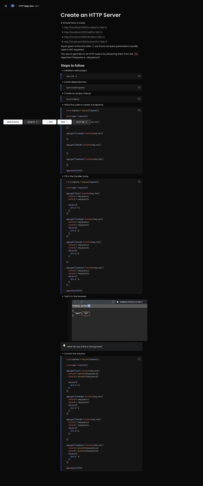
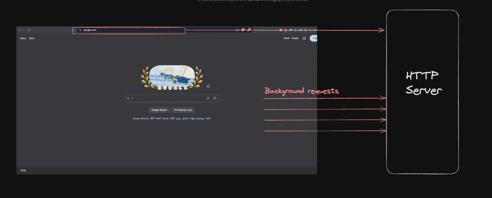
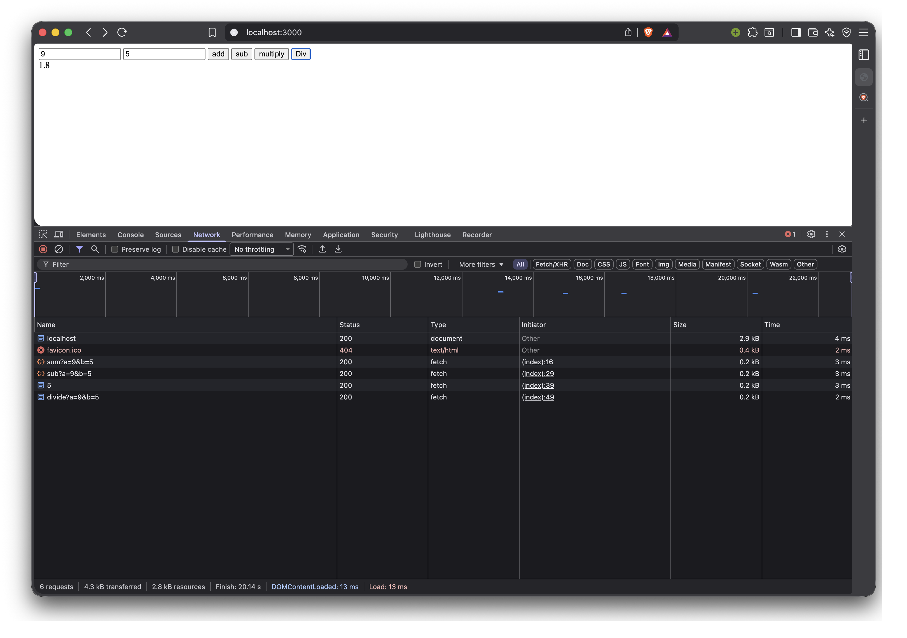

# HTTP Server - Intro (Theory)
- what's http protocol
- request
- response body
- req res model
- body/payload
- methods
  - GET
  - POST
  - PATCH
  - PUT
  - DELETE
- Domain name/IP
- status codes
- HTTP Clients
  - curl
  - browsers
  - postman/requestly

# HTTP Deep Dive
## Create an HTTP Server - Express
- Practice Code: [Calculator with Backend](/backend/calculator-http-server/)
- Technically we could do this using DOM only using onclick and all.

---

#### The misconception
- While building the calculator backend.
- It is very much possible to create the calculator app using the DOM manipulation.
- But that would make the app only a **client side** application, what that mean is, anyone can read the logic of the app how it’s get built, since the frontend will be rendered to the browser.
- So when we are building the backend we are keeping the core logic of the app hidden.
- But we need our frontend to talk to our backend, the frontend as a client and the backend as a server.
- That is where Fetch api comes in
---

## Fetch API
- This is how frontend talks to backend using the endpoints
- There are 2 high level ways a browser can send requests to an HTTP server:


**1. From the browser URL (Default GET request):**
- When you type a URL into the browser’s address bar and press Enter, the browser sends an HTTP GET request to the server. This request is used to retrieve resources like HTML pages, images, or other content.

**2. From an HTML form or JavaScript (Various request types):**
- HTML Forms: When a user submits a form on a webpage, the browser sends an HTTP request based on the form’s method attribute, which can be GET or POST. Forms with method="POST" typically send data to the server for processing (e.g., form submissions).

- **JavaScript (Fetch API):** JavaScript running in the browser can make HTTP requests to a server using APIs the fetch API. These requests can be of various types (GET, POST, PUT, DELETE, etc.) and are commonly used for asynchronous data retrieval and manipulation (e.g., AJAX requests).

#### Fetch request examples
Server to send the request to - https://jsonplaceholder.typicode.com/posts/1 (GET request)

```html
<!DOCTYPE html>
<html>

<body>
  <div id="posts"></div>
  <script>
    async function fetchPosts() {
      const res = await fetch("https://jsonplaceholder.typicode.com/posts/1");
      const json = await res.json();
      document.getElementById("posts").innerHTML = json.title;
    }

    fetchPosts();
  </script>
</body>

</html>

```

- till now we have built this, a functional backend of a calculator app


--- 

##### Using axios (external library)

```html
<!DOCTYPE html>
<html>

<head>
  <script src="https://cdnjs.cloudflare.com/ajax/libs/axios/1.7.6/axios.min.js"></script>
</head>

<body>
  <div id="posts"></div>
  <script>
    async function fetchPosts() {
      const res = await axios.get("https://jsonplaceholder.typicode.com/posts/1");
      document.getElementById("posts").innerHTML = res.data.title;
    }

    fetchPosts();
  </script>
</body>

</html>
```

