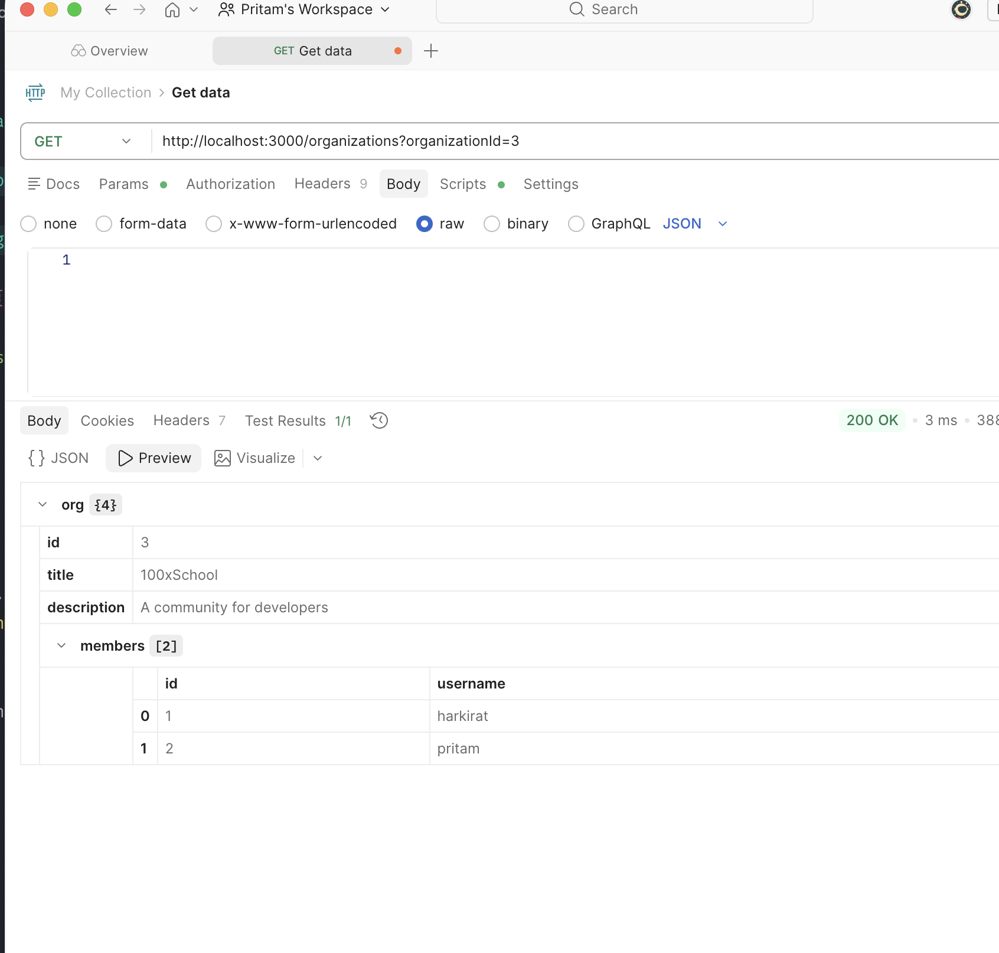

# FlowBoard – In-Memory Data Structure (v1)

## Overview

This project simulates a **Trello-like task management system** using an in-memory data structure (no database). The goal is to understand how backend systems model relationships between entities before introducing persistence layers like SQL or NoSQL databases.

The architecture follows a **relational mindset using plain JavaScript objects and arrays**, where entities are connected using IDs.

---

## Core Entities

### 1. USERS

Represents all registered users in the system.

```js
const USERS = [
  {
    id: 1,
    username: "harkirat", // must be unique
    password: "123123",
  },
  {
    id: 2,
    username: "pritam",
    password: "123123",
  },
];
```

#### Key Points:

- `id`: Unique identifier
- `username`: Must be unique (important constraint)
- `password`: Stored as plain text (temporary; should be hashed in real systems)

---

### 2. ORGANIZATIONS

Represents groups or teams where users collaborate.

```js
const ORGANIZATIONS = [
  {
    id: 1,
    title: "100xdevs",
    description: "Learning coding platform",
    admin: 1,
    members: [2], //members id who gets access
  },
  {
    id: 2,
    title: "pritam's org",
    description: "Experimenting",
    admin: 1,
    members: [],
  },
];
```

#### Key Points:

- `admin`: User ID of the organization owner
- `members`: Array of user IDs who have access
- Enables **multi-user collaboration system**

---

### 3. BOARDS

Represents project boards (like Trello boards).

```js
const BOARDS = [
  {
    id: 1,
    title: "100xdevs website (frontend)",
    organizationId: 1,
  },
  {
    id: 2,
    title: "Another board",
    organizationId: 1,
  },
];
```

#### Key Points:

- Each board belongs to an `organization`
- Boards act as containers for issues/tasks

---

### 4. ISSUES

Represents tasks or tickets inside a board.

```js
const ISSUES = [
  {
    id: 1,
    title: "Add dark mode",
    boardId: 1,
  },
  {
    id: 2,
    title: "Allow admins to create more courses",
    boardId: 1,
  },
];
```

#### Key Points:

- Each issue belongs to a `board`
- This is equivalent to "cards" in Trello
- Currently minimal, but can be extended

---

## Relationships (Critical Understanding)

This system follows **ID-based referencing**:

```
USER → ORGANIZATION → BOARD → ISSUE
```

### Relationship Flow:

- A **User** can:
  - Own an Organization (`admin`)
  - Be part of multiple Organizations (`members`)

- An **Organization** can:
  - Have multiple Boards

- A **Board** can:
  - Have multiple Issues

---

## Design Philosophy

### 1. Flat Structure (No Deep Nesting)

Instead of embedding objects inside each other:

- Use IDs to reference relationships
- Keeps structure scalable and clean

---

### 2. Database Simulation

This mimics real-world backend design:

- USERS → Table
- ORGANIZATIONS → Table
- BOARDS → Table
- ISSUES → Table

You are essentially building a **manual relational database**

---

### 3. Extensibility

This structure can be extended with:

- Issue description
- Status (todo, in-progress, done)
- Priority
- Comments
- Assigned users
- Due dates

---

## Current Limitations

- No persistence (data resets on restart)
- No authentication/security (passwords are plain text)
- No validation (duplicate IDs possible)
- No ordering system (issues are not sorted)

---

## Next Steps (Recommended)

1. Implement CRUD operations:
   - Create User
   - Create Organization
   - Create Board
   - Create Issue

2. Add validation:
   - Unique usernames
   - Unique IDs

3. Introduce structure improvements:
   - Add `status` to issues
   - Add `createdAt`, `updatedAt`

4. Move toward backend:
   - Express.js API layer
   - Replace in-memory store with database (MongoDB/PostgreSQL)

---

## Key Learning Outcome

This structure builds your understanding of:

- Data modeling
- Entity relationships
- Backend system design fundamentals
- Transition from in-memory → real database systems

---


### 24th March

- Added Frontend custom canvas 


### 27th March

- Added signup signin endpoint
- middleware auth
- Authenticated endpoints
  - create org
  - add member to org
  - get org details by query params
  - tested - working.
  <div style="text-align: center; margin: 10px; border: 0.5px solid black; padding: 7.75px">
    
</div>