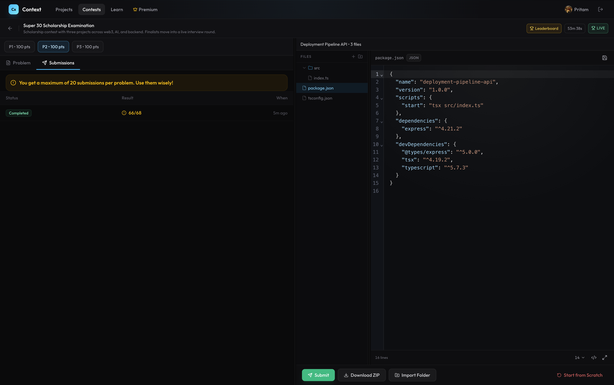

# Deployment Pipeline API

Build an in-memory REST API for managing service deployments across environments: register services, create deployments with environment promotion rules, claim and execute them, handle failures with retries and backoff, track rollbacks, and maintain deployment history.

## Requirements

### Health
- **GET /api/health** -> `200` with `{ "status": "ok" }`

### Services
- **POST /api/services**
  - Body:
    - `name`: non-empty string
    - `repository`: non-empty string
    - `environments`: non-empty array of environment name strings (ordered as the promotion chain)
    - `maxAttempts`: positive integer
    - `backoffSeconds`: positive integer
  - Deduplicate `environments` while preserving first-occurrence order.
  - Returns `201`.
- **GET /api/services**
  - Returns all services in insertion order.
  - Response: `{ services: [...] }`

### Deployments
- **POST /api/deployments**
  - Body: `{ serviceId, environment, commitHash, now? }`
  - `serviceId` must reference an existing service.
  - `environment` must be in the service's environments list.
  - `commitHash`: non-empty string.
  - **Promotion rule**: if the environment is not the first in the chain, there must be a `LIVE` deployment for the same `(serviceId, commitHash)` in the immediately preceding environment.
  - **Idempotent**: on duplicate `(serviceId, environment, commitHash)`, return the existing deployment with status `200`.
  - On first create: status `PENDING`, `nextAttemptAt = now`, returns `201`.
  - `now` defaults to current time if omitted.
- **POST /api/deployments/claim**
  - Body: `{ now? }`
  - Claim the next due deployment:
    1. Only `PENDING` deployments whose `nextAttemptAt <= now`
    2. Sort by `nextAttemptAt` ascending
    3. Tie-break by `createdAt` ascending
  - When claimed: status -> `DEPLOYING`, `attempts += 1`, `claimedAt = now`
  - Returns `200` with `{ deployment }`
  - Returns `204` if nothing is due.
- **POST /api/deployments/:id/complete**
  - Body: `{ now? }`
  - Only valid from `DEPLOYING`.
  - Sets status -> `LIVE`, `completedAt = now`, `nextAttemptAt = null`.
  - Any previous `LIVE` deployment for the same `(serviceId, environment)` is set to `SUPERSEDED`.
  - Returns `200` with the updated deployment.
- **POST /api/deployments/:id/fail**
  - Body: `{ error, now? }`
  - Only valid from `DEPLOYING`.
  - Stores `lastError = error`.
  - If `attempts < maxAttempts` (from the service):
    - status -> `PENDING`, clear `claimedAt`
    - `nextAttemptAt = now + attempts * backoffSeconds` (in seconds)
  - Otherwise:
    - status -> `DEAD`, `completedAt = now`, `nextAttemptAt = null`
  - Returns `200` with the updated deployment.
- **POST /api/deployments/:id/rollback**
  - Body: `{ now? }`
  - Only valid when the deployment status is `LIVE`.
  - Find the most recent `SUPERSEDED` deployment for the same `(serviceId, environment)`.
  - If found: set it to `LIVE`, set the current deployment to `ROLLED_BACK`.
  - If not found: return `400` (nothing to roll back to).
  - Returns `200` with `{ rolledBack, revived }`.
- **GET /api/deployments/:id**
  - Return the current deployment snapshot.
  - Return `404` if missing.
- **GET /api/services/:id/deployments**
  - Optional query: `environment`, `status`
  - Returns deployments for that service, sorted by creation order.
  - Response: `{ deployments: [...] }`
  - Return `404` for missing service.
- **GET /api/deployments/:id/history**
  - Response: `{ history: [...] }`
  - Sort by `at` ascending.
  - Each entry: `{ type, at, attempt }`
  - History entry types:
    - `CREATED` (when deployment is first created, attempt = 0)
    - `CLAIMED` (when claimed by a worker)
    - `DEPLOYED` (when completed successfully)
    - `FAILED` (when failed, either retrying or going dead)
    - `DEAD` (when all retries exhausted)
    - `SUPERSEDED` (when replaced by a newer deployment)
    - `ROLLED_BACK` (when rolled back)
    - `REVIVED` (when restored to LIVE from a rollback)

### Constraints
- Use in-memory storage only.
- IDs can be any unique string format.
- Timestamps in responses must be ISO strings.
- Any supplied `now` must be a full ISO datetime string with both time and timezone. Date-only values like `2026-03-20` are invalid.
- Return `400` when a supplied `now` override is not a valid ISO datetime.
- Return `404` for missing service/deployment IDs.

## Start Command
```
npm install && npm start
```


### Result (Done completely by Cursor and GPT - I don't even know this topics)


